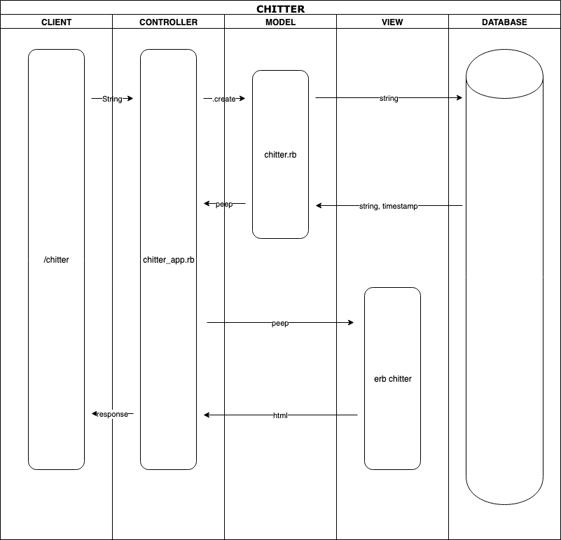

# Chitter Challenge

## Instructions:
### Installation:
#### Database:
1. Connect to psql
2. Create the database using the psql command CREATE DATABASE chitter;
3. Connect to the database using the pqsl command \c bookmark_manager;
4. Run the query saved in the file 01_create_peeps_table.sql
5. Run the query saved in the file 02_create_users_table.sql
5. Create the test database using the psql command CREATE DATABASE chitter_test;
6. Repeat steps 3 to ...

#### Usage:
1. `git clone https://github.com/saypop/chitter-challenge.git`
2. `cd chitter-challenge`
3. `bundle`
4. `rackup`
5. Visit [localhost:9292](localhost:9292)
6. Write a peep and submit.
7. Note: registration flow is hardcoded so will always create a profile for 'John Doe'.

#### Testing:
`rspec`

## Challenge:

Our week 4 challenge at Makers Academy was to write a Twitter clone. Features of this clone needed to include:
1. Being able to view all peeps (even when not logged in).
2. User creation with an email, password, name and username.
3. Usernames and emails need to be unique (i.e. a user cannot sign up twice with the same email address and two users can't share a user name).
4. Peeps need to have the username and name of the user displayed with them.
5. A README with a list of all tech used and instructions for usage and testing.

### User Stories:

#### User Story 1
```
  As a Maker
  So that I can let people know what I am doing
  I want to post a message (peep) to chitter
```
To satisfy this user story I am going to create a database called Chitter with a table called Peeps. Bearing in mind that I will need to have the username and name of the author displayed on the peep, I will include a field for user id in the table. Also because I will need to order peeps by time, I will include a timestamp too. So:
id  |peep   |user_id   |timestamp
--|---|--|--
1  |"The first ever peep"   |1   |2019/03/29 10:00
2  |"What is this?"   |2   |2019/03/29 10:01
3  |"It's Chitter!"   |1   |2019/03/29 10:03
I will also set a character limit, so that peeps don't get to long and bore users.

Here is a domain model for this user story:


Before I tackled the second user story which I set up the testing environment to make executing over connections easier. This included test driving the development of a connection class and a peep class.

#### User Story 2
```
  As a maker
  So that I can see what others are saying
  I want to see all peeps in reverse chronological order
```
To satisfy this user story I am going to have test drive the development of .all method for the Peep class which should return an array of Peep instances and a timestamp. First I'll test drive the simplest solution using an hardcoded array in the app then move on to the unit test for the all method. Once this is done I will create a time_helper that sleeps the program for a given time to ensure time differences between entries.

#### User Story 3
```
  As a Maker
  So that I can better appreciate the context of a peep
  I want to see the time at which it was made
```
This user story is already satisfied but the time is shown as a timestamp. I am going to change so time as a time since posting with the following rules:
 - if the time since posting is less than a minute the time difference will be shown in seconds;
 - if the time since posting is less than an hour the time difference will be shown in minutes;
 - if the time since posting is less than a day the time difference will be shown in hours;
 - if the time since posting is less than a month the time difference will be shown in days;
 - if the time since posting is less than a year the time difference will be shown in months;
 - otherwise the time difference will be shown in years.
To do this I will need to test drive the development of a lapsed_time method. To feature test the result I will need to learn how to use Timecop. I ended up extracting this into a new class.

#### User Story 4
```
  As a Maker
  So that I can post messages on Chitter as me
  I want to sign up for Chitter
```
To satisfy this story I will need to create a page that asks the user to sign in and when they are signed in any peep they post should have their username and name on it. **This is as far as I got.**

Next steps would be: Once I solve this in the simplest way, I will need to create a user class and data table and change the peep class so that it initializes with an instance of the user class injected into it.
